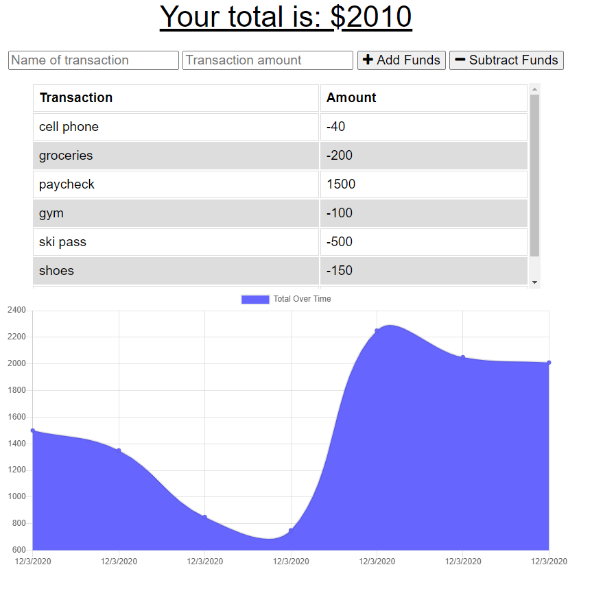

# Budget Tracker

## Description
This application allows the user to track their budget with the special feature of offline tracking.  If the user loses internet connection the application will store transactions in indexedDB unitl an internet connection resumes.  The application will then update the database.  This is particularly useful for travelers.
### Home Page

## Table of Contents
* [Installation](#installation)
* [Usage](#usage)
* [Credits](#credits)
* [License](#license)
* [Contributing](#Contributing)
* [Tests](#Tests)
* [Questions](#Questions)

## Installation
Clone this repository and run command "npm install" to get dependencies

## Usage
### To run locally
Enter the command "npm start" to start application and navigate to localhost:8080 in your browser

*this assumes you have a MongoDB environment already configured.
### Use on Heroku
[Heroku Application](https://korys-budget-app.herokuapp.com/)

## License
This repository is licensed under the MIT license

## Contributing
No additional contributions are expected for this application

## Tests
There are currently no test for this application

## Questions
#### For any questions about this repository send an email to kory.nelson99@gmail.com
#### View my full GitHub at [https://github.com/korynelson](https://github.com/korynelson)